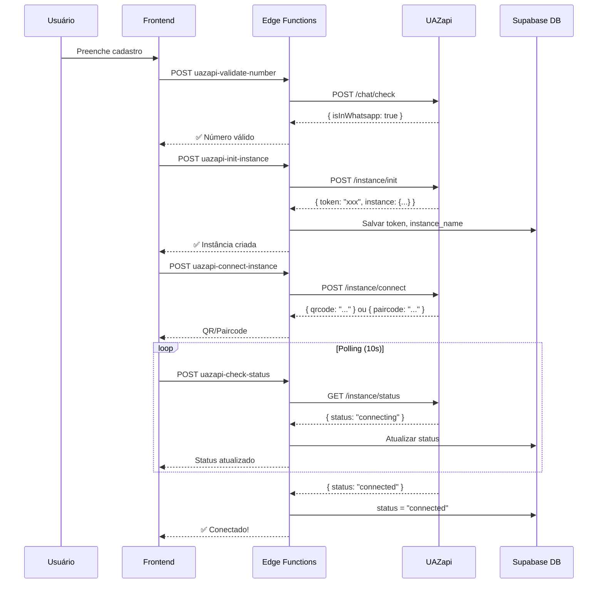

# 🔄 Migração Evolution API → UAZapi

## 📋 Resumo da Migração

Migramos da **Evolution API** para **UAZapi** para melhor estabilidade e recursos. A implementação foi feita usando **Supabase Edge Functions** para máxima segurança.

---

## ✅ O Que Foi Feito

### 1. **Banco de Dados - Novas Colunas**

Adicionadas colunas na tabela `usuarios`:

| Coluna | Tipo | Descrição |
|--------|------|-----------|
| `uazapi_instance_name` | TEXT | Nome da instância (ex: `guido-nicolas-446666`) |
| `uazapi_token` | TEXT | Token único gerado pela UAZapi |
| `uazapi_instance_id` | TEXT | ID interno da instância |
| `uazapi_status` | TEXT | Status: `disconnected`, `connecting`, `connected` |
| `uazapi_profile_name` | TEXT | Nome do perfil WhatsApp |
| `uazapi_profile_pic_url` | TEXT | URL da foto de perfil |
| `uazapi_last_disconnect` | TIMESTAMPTZ | Última desconexão |
| `uazapi_last_disconnect_reason` | TEXT | Motivo da desconexão |

### 2. **Supabase Edge Functions Criadas**

4 Edge Functions foram deployadas:

#### **a) `uazapi-validate-number`**
- **Endpoint:** `POST /chat/check`
- **Uso:** Validar se número está no WhatsApp (no cadastro)
- **Token:** Usa instância Nicolas global

#### **b) `uazapi-init-instance`**
- **Endpoint:** `POST /instance/init`
- **Uso:** Criar instância do usuário
- **Retorno:** Token único que é salvo no banco

#### **c) `uazapi-connect-instance`**
- **Endpoint:** `POST /instance/connect`
- **Uso:** Conectar WhatsApp (gerar QR ou paircode)
- **Lógica:**
  - **Mobile:** Envia `phone` → recebe `paircode`
  - **Web:** Sem `phone` → recebe `qrcode` (base64)

#### **d) `uazapi-check-status`**
- **Endpoint:** `GET /instance/status`
- **Uso:** Polling para verificar status
- **Frequência:** A cada 10-15 segundos durante conexão

---

## 🔐 Secrets do Supabase (OBRIGATÓRIO)

**⚠️ IMPORTANTE:** Configure estes secrets no **Supabase Dashboard → Edge Functions → Secrets**

```bash
# UAZapi - URL base
UAZAPI_URL=https://infuse.uazapi.com

# UAZapi - Admin token (NUNCA expor no frontend!)
UAZAPI_ADMIN_TOKEN=VnQFslXgeZ9vAR1QDxUeY3WMyjq2zeqGHkUyc420L2hRsaajnS

# UAZapi - System name
UAZAPI_SYSTEM_NAME=infuse

# UAZapi - Token da instância Nicolas (para validação global)
UAZAPI_NICOLAS_TOKEN=443290d9-6639-4060-abaa-234079180cfb
```

**Como configurar:**
1. Acesse: https://supabase.com/dashboard/project/zpzzvkjwnttrdtuvtmwv/settings/functions
2. Clique em "Add new secret"
3. Adicione cada variável acima

---

## 🌐 Variáveis de Ambiente

### `.env` (Local)

```env
# UAZapi - Edge Functions URLs
VITE_UAZAPI_VALIDATE_NUMBER_URL=https://zpzzvkjwnttrdtuvtmwv.supabase.co/functions/v1/uazapi-validate-number
VITE_UAZAPI_INIT_INSTANCE_URL=https://zpzzvkjwnttrdtuvtmwv.supabase.co/functions/v1/uazapi-init-instance
VITE_UAZAPI_CONNECT_INSTANCE_URL=https://zpzzvkjwnttrdtuvtmwv.supabase.co/functions/v1/uazapi-connect-instance
VITE_UAZAPI_CHECK_STATUS_URL=https://zpzzvkjwnttrdtuvtmwv.supabase.co/functions/v1/uazapi-check-status
```

### Vercel (Produção)

Adicione as mesmas variáveis no painel da Vercel:
1. Acesse: https://vercel.com/seu-projeto/settings/environment-variables
2. Adicione cada `VITE_UAZAPI_*` variável

---

## 🔄 Comparação: Evolution vs UAZapi

| Recurso | Evolution API | UAZapi |
|---------|---------------|---------|
| **Criar Instância** | `/instance/create` | `/instance/init` |
| **Validar WhatsApp** | `/chat/whatsappNumbers/{instance}` | `/chat/check` |
| **Conectar** | Incluído no create | `/instance/connect` (separado) |
| **Status** | ❌ Não documentado | ✅ `/instance/status` |
| **Auth Header** | `apikey` | `admintoken` (init) / `token` (outros) |
| **Token** | Cliente envia | **Servidor gera** |
| **QR Code** | Imediato | Via `/connect` + `/status` |
| **Paircode** | ❌ | ✅ Suporte mobile |
| **Segurança** | Credenciais no frontend | **Edge Functions (server-side)** |

---

## 📱 Fluxo Novo de Cadastro



---

## 🎯 Próximos Passos (Frontend)

### Arquivos a Modificar:

1. **`src/hooks/useWhatsAppValidation.ts`**
   - Trocar chamada direta para `VITE_UAZAPI_VALIDATE_NUMBER_URL`

2. **`src/services/evolutionAPI.ts`**
   - Renomear para `uazapiService.ts`
   - Trocar chamadas para Edge Functions

3. **`src/components/widgets/EvolutionWhatsAppWidget.tsx`**
   - Adicionar detecção mobile vs web
   - Implementar polling de status
   - Exibir QR ou paircode conforme dispositivo

### Exemplo de Chamada no Frontend:

```typescript
// Validar número
const response = await fetch(import.meta.env.VITE_UAZAPI_VALIDATE_NUMBER_URL, {
  method: 'POST',
  headers: {
    'Content-Type': 'application/json',
    'apikey': import.meta.env.VITE_SUPABASE_ANON_KEY
  },
  body: JSON.stringify({ numbers: ['5561981446666'] })
});

// Criar instância
const response = await fetch(import.meta.env.VITE_UAZAPI_INIT_INSTANCE_URL, {
  method: 'POST',
  headers: {
    'Content-Type': 'application/json',
    'apikey': import.meta.env.VITE_SUPABASE_ANON_KEY,
    'Authorization': `Bearer ${session.access_token}`
  },
  body: JSON.stringify({
    nome: 'João',
    whatsapp: '5561981446666',
    userId: user.id
  })
});

// Conectar (mobile)
const isMobile = window.innerWidth < 768; // Ou usar user-agent

const response = await fetch(import.meta.env.VITE_UAZAPI_CONNECT_INSTANCE_URL, {
  method: 'POST',
  headers: {
    'Content-Type': 'application/json',
    'apikey': import.meta.env.VITE_SUPABASE_ANON_KEY,
    'Authorization': `Bearer ${session.access_token}`
  },
  body: JSON.stringify({
    userId: user.id,
    isMobile: isMobile,
    phone: isMobile ? '5561981446666' : undefined
  })
});

// Polling de status
const interval = setInterval(async () => {
  const response = await fetch(import.meta.env.VITE_UAZAPI_CHECK_STATUS_URL, {
    method: 'POST',
    headers: {
      'Content-Type': 'application/json',
      'apikey': import.meta.env.VITE_SUPABASE_ANON_KEY,
      'Authorization': `Bearer ${session.access_token}`
    },
    body: JSON.stringify({ userId: user.id })
  });
  
  const { data } = await response.json();
  
  if (data.status === 'connected') {
    clearInterval(interval);
    // Conectado!
  }
}, 10000); // 10 segundos
```

---

## ⏱️ Timeouts UAZapi

- **QR Code:** 2 minutos (gerar novo com `/connect`)
- **Paircode:** 5 minutos (gerar novo com `/connect`)

**Solução:** Se timeout, chamar novamente `uazapi-connect-instance` para gerar novo QR/paircode.

---

## 📞 Detecção Mobile vs Web

```typescript
// Opção 1: Largura da tela
const isMobile = window.innerWidth < 768;

// Opção 2: User-Agent (mais preciso)
const isMobile = /Android|iPhone|iPad|iPod/i.test(navigator.userAgent);

// Opção 3: Deixar usuário escolher
const [connectionMethod, setConnectionMethod] = useState<'qr' | 'paircode'>('qr');
```

---

## 🧪 Testes

### 1. Validar Número

```bash
curl -X POST https://zpzzvkjwnttrdtuvtmwv.supabase.co/functions/v1/uazapi-validate-number \
  -H "Content-Type: application/json" \
  -H "apikey: YOUR_SUPABASE_ANON_KEY" \
  -d '{"numbers": ["5561981446666"]}'
```

### 2. Criar Instância (precisa autenticação)

```bash
curl -X POST https://zpzzvkjwnttrdtuvtmwv.supabase.co/functions/v1/uazapi-init-instance \
  -H "Content-Type: application/json" \
  -H "apikey: YOUR_SUPABASE_ANON_KEY" \
  -H "Authorization: Bearer YOUR_ACCESS_TOKEN" \
  -d '{"nome": "João", "whatsapp": "5561981446666", "userId": "uuid-do-usuario"}'
```

---

## ❓ Troubleshooting

### Erro: "Missing configuration"
- Verifique se os secrets estão configurados no Supabase Dashboard

### Erro: "User not found or no token"
- Certifique-se que a instância foi criada (`uazapi-init-instance`)
- Verifique se `userId` está correto

### QR Code não aparece
- Verifique resposta de `/uazapi-connect-instance`
- Certifique-se que `isMobile: false` (ou sem `phone`)

### Paircode não aparece
- Certifique-se que `isMobile: true` ou `phone` está sendo enviado

---

## 📚 Referências

- **UAZapi Docs:** https://infuse.uazapi.com/docs
- **Edge Functions:** https://supabase.com/docs/guides/functions
- **Migration:** `supabase/migrations/add_uazapi_fields_to_usuarios.sql`

---

**Data da Migração:** 2025-11-12  
**Responsável:** Claude AI + Usuário

