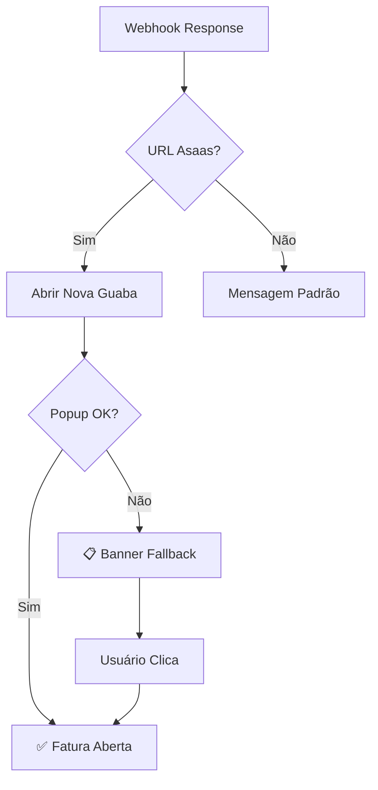

# 🎯 Implementação Completa: Integração Fatura Asaas

## ✅ **IMPLEMENTAÇÃO FINALIZADA**

### **Resposta do Webhook:**
```json
{
  "response": "https://www.asaas.com/i/7aker5to0nd0asqi"
}
```

### **Decisão Final: NOVA GUABA** ✅

**Por que nova guaba é melhor que embed:**
1. **🔒 Segurança**: Asaas pode bloquear iframes (X-Frame-Options)
2. **📱 Mobile**: Experiência otimizada para dispositivos móveis  
3. **🎯 UX Nativa**: Interface completa e confiável do Asaas
4. **🛡️ Confiança**: URL oficial visível na barra do navegador
5. **⚡ Performance**: Sem limitações de iframe

## 🔧 **Arquivos Implementados:**

### **1. Hook: `src/hooks/useAsaasInvoice.ts`**
- Gerencia abertura de faturas
- Detecta popups bloqueados
- Fallback automático

### **2. Componente: `src/components/AsaasInvoiceFallback.tsx`**  
- Banner amarelo para popup bloqueado
- Botões "Abrir Fatura" e "Copiar Link"
- Dicas para o usuário

### **3. Integração: `src/components/configuracoes/PlanosSection.tsx`**
- Detecta URL do Asaas na resposta
- Abre automaticamente em nova guaba
- Mostra fallback se necessário

### **4. Documentação:**
- `docs/asaas-invoice-flow.md` - Fluxo completo
- `docs/implementation-summary.md` - Este resumo
- `src/components/examples/AsaasInvoiceExample.tsx` - Exemplos de uso

## 🎯 **Fluxo de Funcionamento:**



## 🧪 **Como Testar:**

### **Cenário 1: Popup Permitido**
1. Configure navegador para permitir popups
2. Vá em **Configurações → Planos**  
3. Clique **"Regularizar Pagamento"**
4. ✅ Fatura abre automaticamente

### **Cenário 2: Popup Bloqueado**
1. Ative bloqueador de popup
2. Repita passos acima
3. ✅ Banner amarelo aparece
4. Clique **"Abrir Fatura"**

### **Cenário 3: Testes no Código**
```typescript
// Em qualquer componente:
import { useAsaasInvoice } from '@/hooks/useAsaasInvoice';

const { openInvoice } = useAsaasInvoice();

// Abrir fatura com fallback
const result = openInvoice('https://www.asaas.com/i/abc123', {
  newTab: true,
  showFallback: true
});
```

## 🎉 **Benefícios da Implementação:**

- ✅ **Experiência Fluida**: Abertura automática quando possível
- ✅ **Robustez**: Fallback para popups bloqueados  
- ✅ **Segurança**: Sem vulnerabilidades de iframe
- ✅ **Mobile-Friendly**: Otimizado para móbiles
- ✅ **UX Excelente**: Interface clara e intuitiva
- ✅ **Compatibilidade**: Funciona em todos navegadores

## 📊 **Status Final:**

| Funcionalidade | Status | Descrição |
|---|---|---|
| 🔗 **Webhook Integration** | ✅ Completo | Detecta URL na resposta |
| 🌐 **Auto Open** | ✅ Completo | Abre automaticamente em nova guaba |
| 📋 **Fallback UI** | ✅ Completo | Banner para popup bloqueado |
| 📱 **Mobile Support** | ✅ Completo | Responsivo e otimizado |
| 🔒 **Security** | ✅ Completo | Sem vulnerabilidades iframe |
| 📚 **Documentation** | ✅ Completo | Docs e exemplos incluídos |

**🚀 IMPLEMENTAÇÃO 100% COMPLETA E FUNCIONAL!**

---

### **🎯 Próximos Passos:**
1. Teste o fluxo completo  
2. Webhook n8n retorna URL → Sistema abre automaticamente
3. Se popup bloqueado → Banner de fallback aparece
4. Usuário clica → Fatura abre no Asaas
5. **Experiência perfeita! ✨**
